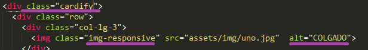
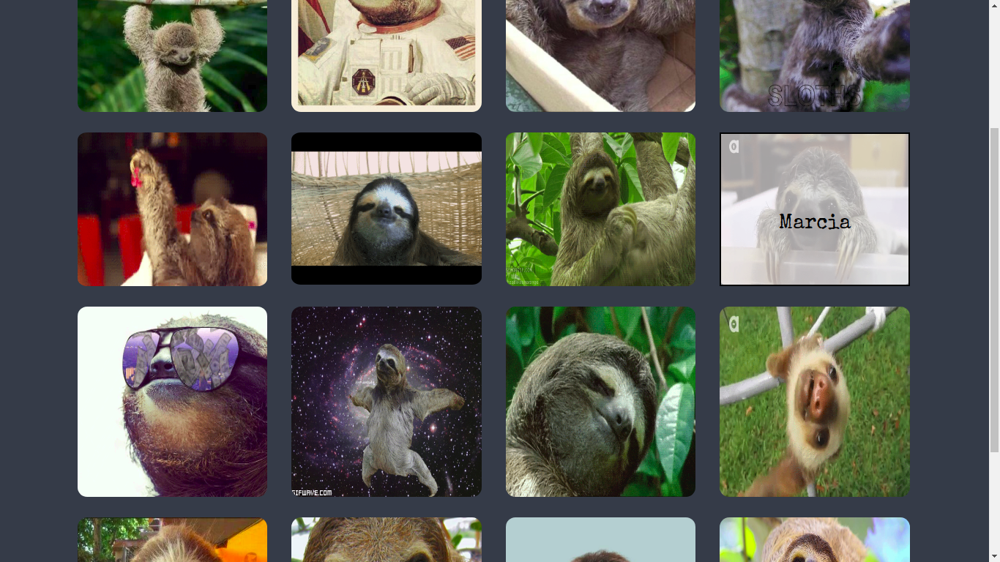

[](https://github.com/meliveloz/cardify)  []() 

# Cardify

***
Es un plugin de jQuery para Bootstrap que permite que tus imágenes almacenadas dentro de un contenedor sean reemplazadas por un nuevo elemento `<figure>` que a su vez posee un `<figcaption>` con el texto del atributo `alt` de la imagen.
Además al pasar el mouse sobre la imagen lograremos ver el contenido del 
`<figcaption>`.
***

### Requerimientos Técnicos

El proyecto fue realizado con las siguientes dependencias NPM:

##### Dependencias de Producción
  - JQuery ~v. 3.2.1
  - Bootstrap ~v. 3.3.7
  - Jsdom ^11.6.1
  - Browserify ^15.2.0

##### Dependencias de Desarrollo
  - Chai ^ 4.1.2
  - Mocha ^ 5.0.0
  - Browserify ^ 15.2.0 

### Uso

+ Descarga este repositorio e incluye la carpeta en tu proyecto.
+ Debes usar class = 'cardify' en el elemento que contiene las imagenes.
+ Recuerda usar la class de bootstrap class='img-responsive' en tus imagenes.
+ Debes incluir el atributo alt en tus imagenes con el texto que desees.



```
  `Por último añade este script en tu html.
  <script type="text/javascript" src="cardify-master/lib/main.js"></script>
```


### Ejemplo




### Licencia

+ [ISC License](https://opensource.org/licenses/ISC)
   
